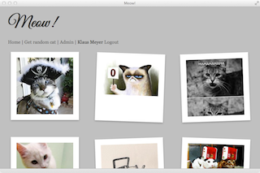
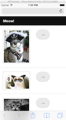

Meow!
=====

This rails application is a simple gallery, that I use to collect funny cat-pictures and send them to my friends to annoy them :)

Functions
---------
* List Images
* Get Random Image
* Import Images from Folder
* Import Images from Dropbox (using SDK)
* User Management with Permissions:
  * Delete Images
  * Upload Imagess via Browser (todo)
* RSS Feed
* Mobile Version using [Foundation][1] Framework

Licence
-------
GPLv2, see [LICENCE][2]

Screenshots
-----------
Desktop Version:

Mobile Version:

[1]: http://foundation.zurb.com
[2]: LICENCE